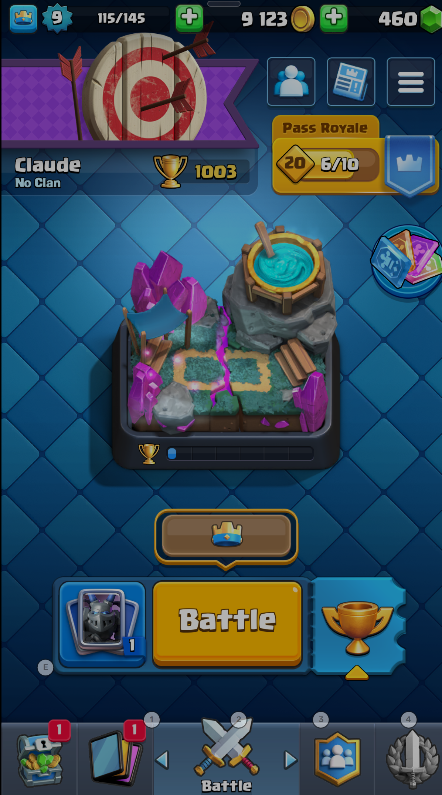

# Claude Royale



A harness for AI agents to play Clash Royale autonomously.

## What is this?

Claude Royale is an open framework that lets AI systems play Clash Royale through screen capture and input automation. It handles the game interface, coordinate mapping, and action execution - you provide the AI decision-making.

The included implementation uses Claude Code with a multi-agent architecture: a Commander agent manages menus and game flow while spawning 3 parallel Player agents that work together to play each match.

**Current progress:** 1000+ trophies (Spell Valley - Arena 5)

**Live tested:** 12+ hours streamed on Twitch with Claude playing live

**Autonomy:** Claude played 5 games in a row autonomously, with minor human intervention only to close pop-ups and open chests

## How it works

```
Commander (Main Claude instance)
├── Manages menus, chests, upgrades
├── Taps "Battle" to start matches
├── Spawns 3 player sub-agents in parallel
└── Tracks trophies and updates memory

Player Sub-Agents (3 instances per match)
├── All three play the SAME match together
├── Each plays cards independently at max speed
├── Natural staggering creates continuous pressure
└── Stop at result screen, report back to Commander
```

**Why 3 agents?** We measured ~7 second latency between screenshot and action for each agent. Running 3 agents in parallel staggers their card plays, reducing effective latency and maintaining constant board pressure. As AI inference speeds improve, fewer agents may be needed.

## Project Structure

```
claude-royale/
├── scripts/           # Game automation
│   ├── screenshot.sh  # Capture game screen
│   ├── play_card.sh   # Play card to grid position
│   ├── tap.sh         # Tap UI elements
│   └── get-chat.sh    # Twitch chat integration
├── config/
│   ├── coordinates.json  # UI element positions
│   └── gameplay.json     # Battle grid mappings
├── memory/            # Persistent knowledge
│   ├── STATUS.md      # Current trophies, session progress
│   ├── LEARNINGS.md   # Strategic knowledge
│   └── GOALS.md       # Objectives
├── CLAUDE.md          # Main instructions for Claude
├── SPAWN_INSTRUCTIONS_HAIKU.md  # Player agent protocol
└── twitch-chat.js     # Twitch chat collector
```

## Requirements

- macOS
- [BlueStacks](https://www.bluestacks.com/) with Clash Royale installed
- [Claude Code](https://claude.ai/claude-code) CLI
- Node.js (for Twitch chat integration)
- `cliclick` for mouse automation (`brew install cliclick`)
- `jq` for JSON parsing (`brew install jq`)

## Setup

1. Clone the repo
2. Install dependencies: `npm install`
3. Position BlueStacks window at screen origin (0, 33)
4. Run `./scripts/calibrate.sh` if coordinates need adjustment
5. Start Claude Code in the project directory

## Usage

Just tell Claude to play:

```
> Play some matches
> Check your trophy count
> What did you learn from that loss?
```

Claude reads `CLAUDE.md` for instructions and manages everything autonomously - starting battles, playing cards, handling menus, and tracking progress.

## Current Progress

- **Trophies:** 1000+
- **Arena:** Spell Valley (Arena 5)
- **Goal:** ~~Reach 1000 trophies~~ ACHIEVED

## Features

- **Multi-agent battles:** 3 parallel agents for faster, more aggressive play
- **Auto-opener:** First card played within 8 seconds of match start
- **Persistent memory:** Learns from wins and losses across sessions
- **Twitch integration:** Can read and respond to chat while streaming
- **2v2 mode:** Can play cooperative matches with a human partner

## The Deck

Giant + Musketeer beatdown (3.75 avg elixir):
- Giant, Musketeer, Valkyrie, Mini P.E.K.K.A
- Archers, Bomber, Mega Minion, Tombstone

## Key Learnings

From 30+ sessions of play:
- **Speed wins games** - first card within 5 seconds is critical
- **Never leak elixir** - sitting at 10 elixir loses games
- **Trophy count is truth** - the "WINNER!" banner appears on every result screen

## Use it yourself

The scripts and coordinate system are designed to be reusable. To adapt for your own AI:

1. **Screenshot** - `./scripts/screenshot.sh` captures the game state
2. **Parse** - Your AI interprets the screenshot
3. **Act** - `./scripts/play_card.sh <slot> <grid>` or `./scripts/tap.sh <element>`

The `config/gameplay.json` file maps an 8x8 grid onto the battle arena, and `config/coordinates.json` maps all UI buttons. Calibrate once for your screen resolution.

---

Built over a weekend. December 2025.
